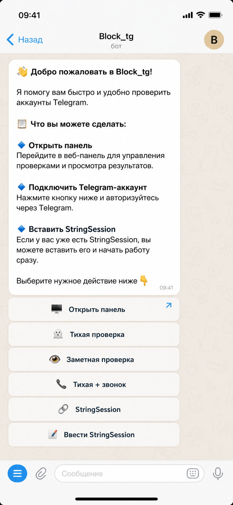
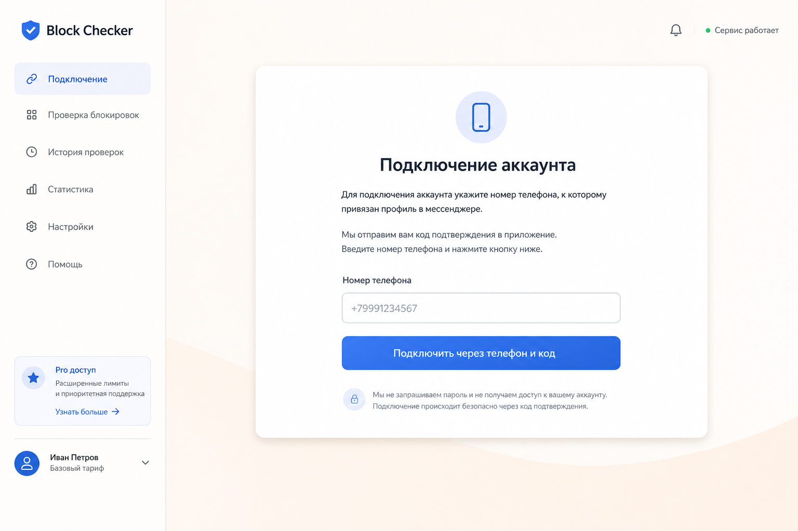
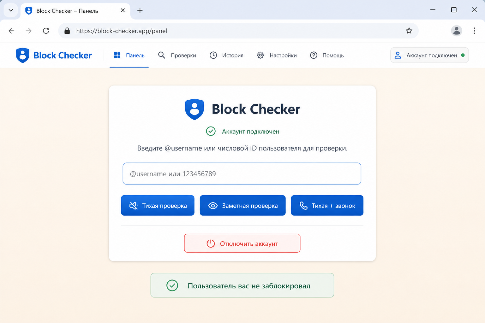

# Block_tg

Telegram-бот и веб-панель на FastAPI для проверки, заблокировал ли вас другой пользователь в Telegram.

## Зачем это нужно

Telegram не даёт прямого способа узнать, заблокировали вас или нет. У пользователя нет отдельного флага, публичного API или штатной кнопки, которая честно возвращает статус блокировки.

Ни официальный Telegram Bot API, ни типичные форки, обёртки и клиентские библиотеки не отдают такую информацию в явном виде. Поэтому определить блокировку можно только косвенно, через поведение самого Telegram-клиента и аккаунта пользователя.

Этот проект как раз решает эту задачу: бот позволяет определить, есть ли блокировка, и делает это двумя независимыми способами:

- через тихую смену темы чата с откатом;
- через короткий звонок с быстрым сбросом.

Два независимых метода повышают практическую точность проверки и дают запасной путь, если один из сценариев отрабатывает нестабильно.

## Стек

- Python 3.11+
- asyncio
- Telethon
- FastAPI
- Uvicorn
- SQLite
- python-dotenv
- python-multipart
- HTML/CSS
- HMAC-SHA256 signed links

## Что умеет проект

- запускает Telegram-бота как точку входа;
- открывает веб-панель по подписанной ссылке;
- подключает пользовательский аккаунт Telegram через телефон, код и 2FA;
- сохраняет `StringSession` в SQLite;
- проверяет блокировку через смену темы чата или короткий звонок;
- даёт два независимых сценария проверки для большей надёжности результата.

## Интерфейс

Иллюстративные мокапы интерфейса:

### Бот в Telegram



### Подключение аккаунта



### Панель проверки



## Структура проекта

```text
.
├── app/
│   ├── bot.py                 # логика Telegram-бота
│   ├── webapp.py              # FastAPI-приложение
│   ├── config.py              # загрузка настроек и пути
│   ├── logging_utils.py       # настройка логов
│   ├── core/
│   │   ├── checker.py         # проверка блокировки
│   │   └── panel_links.py     # подпись ссылок в панель
│   └── db/
│       └── storage.py         # работа с SQLite
├── scripts/
│   ├── generate_bot_string_session.py
│   └── generate_user_string_session.py
├── session/
│   └── users/
├── main.py                    # точка входа для бота
├── webapp.py                  # импорт FastAPI app для uvicorn
├── requirements.txt
└── README.md
```

## Установка

```bash
python3 -m venv .venv
.venv/bin/pip install -r requirements.txt
```

## Переменные окружения

Создайте `.env` и заполните:

```env
API_ID=
API_HASH=
BOT_TOKEN=
WEB_APP_URL=http://127.0.0.1:8000
APP_SECRET=your-long-random-secret
BOT_STRING_SESSION=
PROXY_URL=
```

## Запуск

В двух терминалах:

```bash
.venv/bin/python main.py
```

```bash
.venv/bin/uvicorn webapp:app --host 0.0.0.0 --port 8000
```

## Полезные скрипты

Сгенерировать пользовательскую `StringSession`:

```bash
.venv/bin/python scripts/generate_user_string_session.py
```

Сгенерировать `StringSession` для бота:

```bash
.venv/bin/python scripts/generate_bot_string_session.py
```

## Как работает

1. Пользователь открывает бота и получает ссылку на панель.
2. Панель подписывается через `HMAC-SHA256`, чтобы ссылку нельзя было подделать.
3. Пользователь подключает свой Telegram-аккаунт.
4. Сессия сохраняется в `block_checker.db`.
5. Проверка выполняется от имени подключённого аккаунта, а не от имени бота.
6. Проект делает косвенный вывод о блокировке по результату одного или двух независимых сценариев проверки.

## Примечания

- Бот и веб-панель должны работать одновременно.
- SQLite и директория `session/` используются обоими процессами совместно.
- Скриншоты в этом README являются иллюстративными мокапами интерфейса.
- Для production лучше вынести панель на публичный домен и добавить нормальную аутентификацию.
